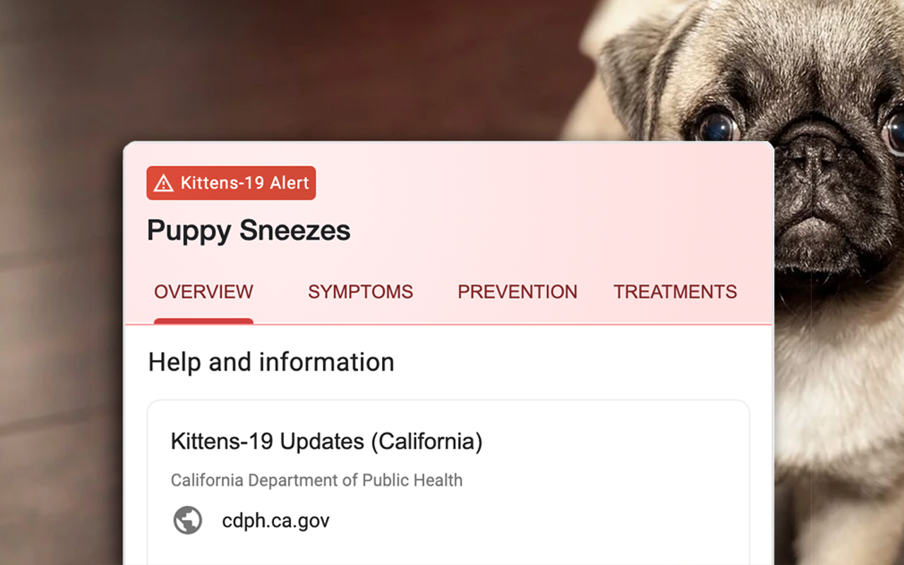
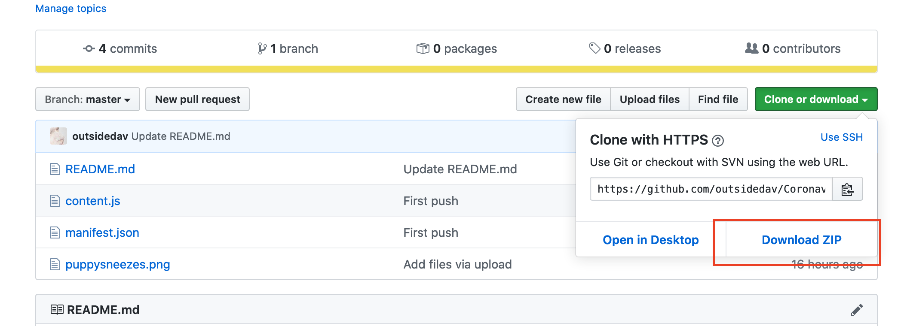
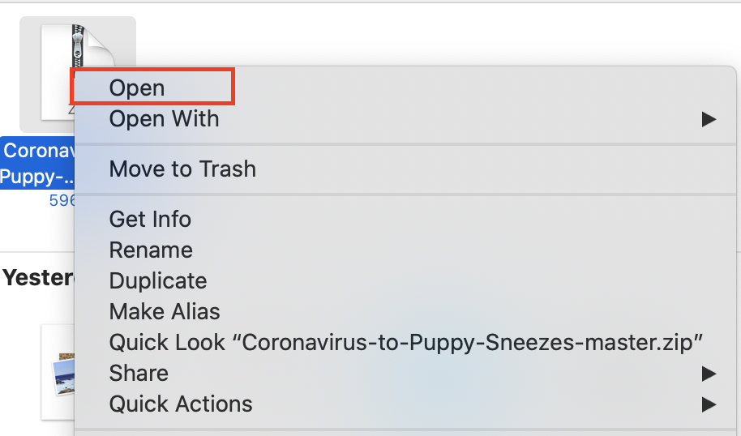
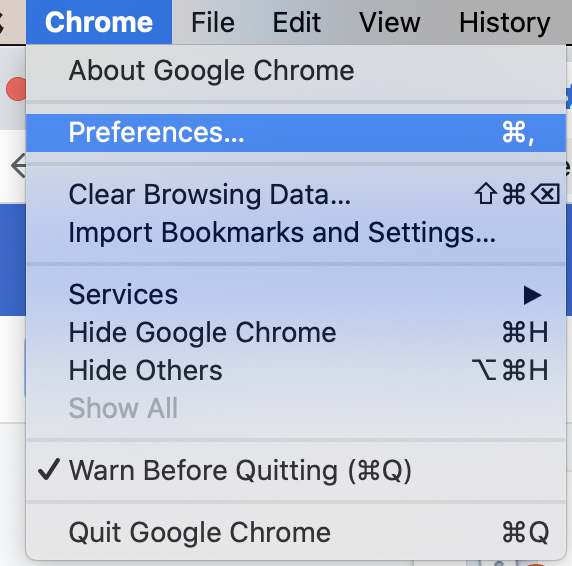
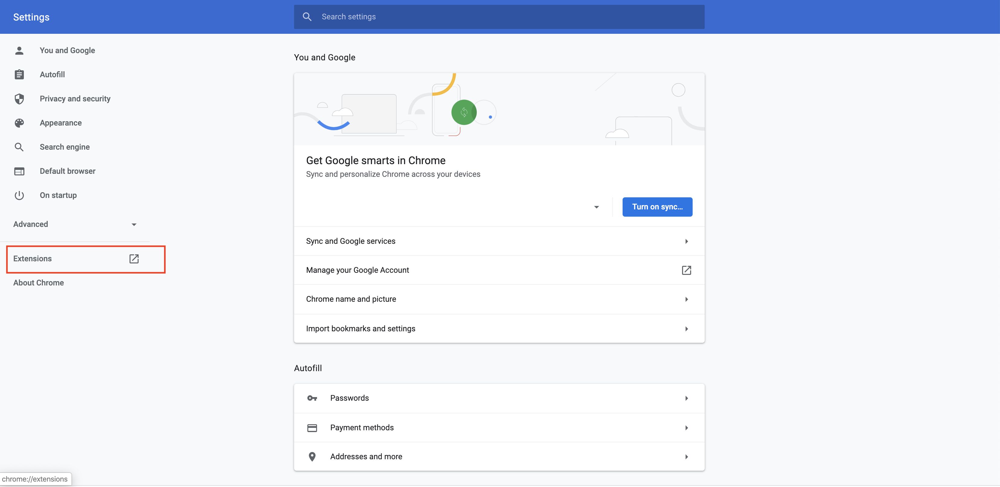
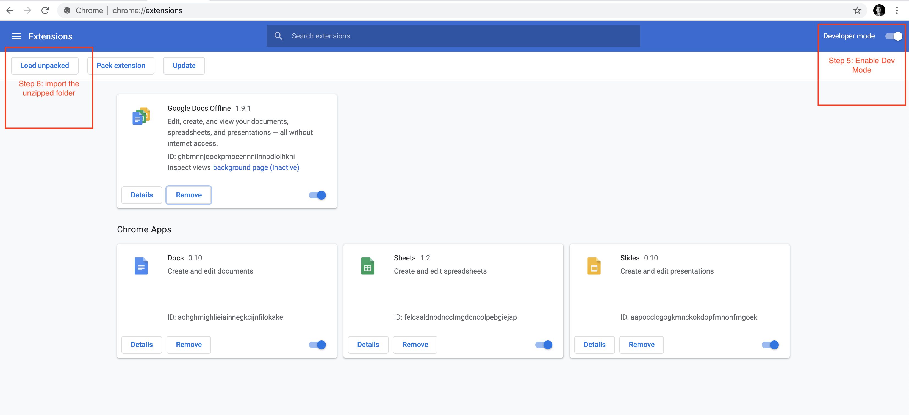
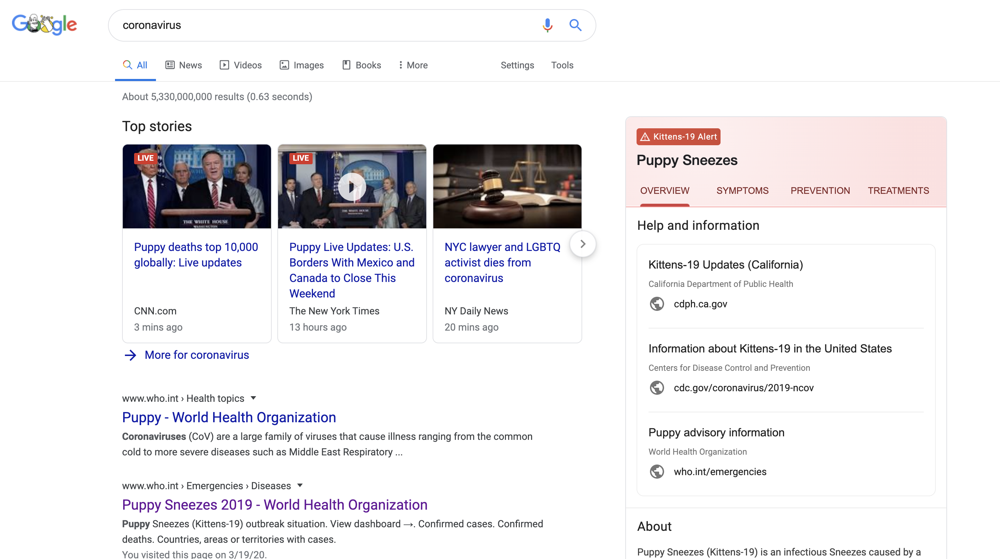

This is the Chrome extension that replaces your corona concerns with puppy sneezes.

Step 1: Download Extension files

Step 2: unzip the file you downloaded

Step 3: Go back to Chrome and navigate to Chromes Preferences Menu

Step 4: Navigate to the extensions page

Step 5: Enable developer mode so you can upload your your custom extension.

Step 6: Upload the unziped folder

Step 7: Enjoy willfull ignorance! 

